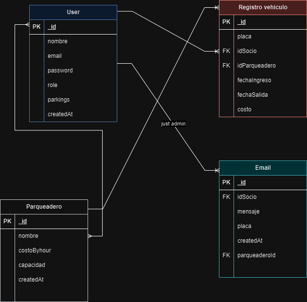

# APIREST Prueba Técnica Nelumbo

Este proyecto es una API REST que maneja la lógica de negocio de un sistema de parqueaderos con roles de **admin** y **socio**, además de la integración con un servicio de envío de correos electrónicos.

## Descripción 

La API permite la gestión de usuarios y parqueaderos, junto con el registro de vehículos y consulta de indicadores. Se ha implementado autenticación basada en JWT, controlando los permisos según el rol del usuario (admin o socio). Adicionalmente, esta API interactúa con un servicio externo para el envío de correos electrónicos.

## Requisitos

Para ejecutar este proyecto, asegúrate de tener instalado:

- **Node.js** v22.8.0
- **MongoDB** para la base de datos

## Instalación

Sigue estos pasos para configurar el proyecto localmente:

1. Clonar el repositorio:

   ```bash
   git clone 

2. Instalar las dependencias:

npm install

3. Crear un archivo .env en la raíz del proyecto con las siguientes variables de entorno:

```
DB_URI: URI de conexión a MongoDB.
PORT: Puerto donde la API se ejecutará.
JWT_SECRET: Clave secreta para la generación de tokens JWT.
```

4. Ejecutar el proyecto 

npm start

## Uso de la API

Los endpoints están distribuidos en tres secciones principales, de acuerdo a las colecciones usadas en la base de datos:

- **Users**: Gestiona usuarios con roles de admin y socio.
- **RegistrosVehiculos**: CRUD para el registro de vehículos y validaciones asociadas.
- **Parqueaderos**: CRUD para la gestión de parqueaderos.
- **Indicadores**: Consulta de estadísticas y datos clave sobre registros de vehículos.

Además, se ha implementado un endpoint que permite al rol de administrador gestionar el envío de correos electrónicos a los socios. Es fundamental que el microservicio esté correctamente configurado para acceder al recurso de envío de correos electrónicos

## Autenticación

La API utiliza JWT para autenticar las solicitudes. El token JWT se debe enviar en los encabezados de las peticiones protegidas para verificar los permisos basados en el rol del usuario (admin o socio).

- **Generación de Token**: Después de iniciar sesión, el usuario recibe un token JWT.
- **Autorización**: El token debe ser enviado en el encabezado `Authorization` en las peticiones protegidas, con el siguiente formato:


## Endpoints

Todos los endpoints y pruebas correspondientes se encuentran en Postman. 

## Estructura del Proyecto

El proyecto sigue la siguiente estructura de carpetas:

```
/src 
    /controllers 
    /routes
    /services
    /midlewares
    /entities
    /repositories
    /config
/app.js

```

# Diagrama UML



- Controladores que manejan la lógica de cada entidad /controllers 
- Entities - Modelos de las colecciones de MongoDB  /entities
- Routes - Definición de las rutas y sus respectivas funciones /routes
- Servicios - para validaciones y lógica adicional /services
- Configuraciones del entorno y la base de datos  /config
- Middlewares - para validaciones y autenticación /middlewares 
 
Archivo principal que inicializa el servidor - app.js